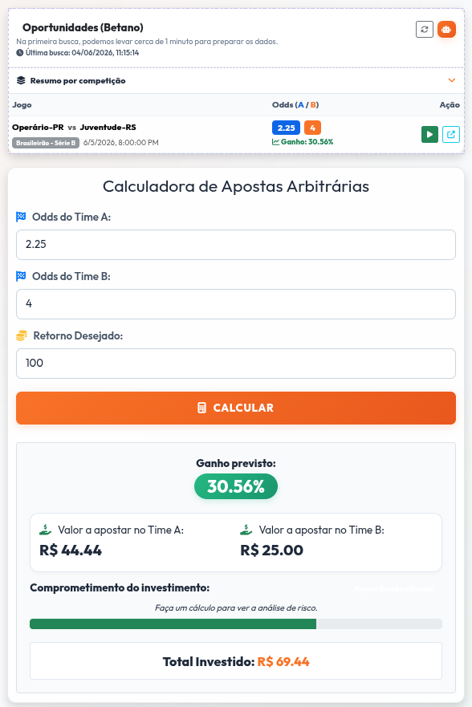
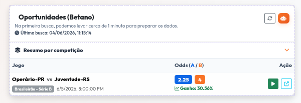
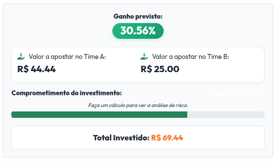
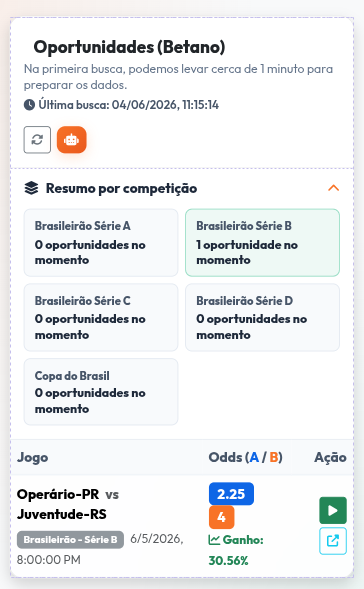

---

## O Produto

O **Arbitragem de Apostas** ajuda a encontrar e calcular oportunidades entre dois resultados possíveis de um jogo: vitória do Time A ou vitória do Time B.

A ferramenta monitora páginas da **Betano**, identifica jogos com odds válidas e exibe apenas oportunidades cujo ganho previsto seja maior que **30%**, usando a regra de negócio atual da aplicação.

> Importante: a estratégia não cobre empate. A ferramenta é um apoio matemático para análise de odds, não uma garantia de lucro.

---
<div align="center">
  
  <h1>Arbitragem de Apostas</h1>
  <p><b>Calculadora e monitor de oportunidades em odds de futebol.</b></p>

  <p>
    <a href="#o-produto">Produto</a> •
    <a href="#como-funciona">Como funciona</a> •
    <a href="#arquitetura">Arquitetura</a> •
    <a href="#rodando-localmente">Rodando localmente</a>
  </p>
</div>


## Como Funciona

1. O robô consulta competições monitoradas na Betano.
2. O scraper coleta dados via respostas JSON e também faz fallback lendo os cards renderizados no DOM.
3. Os dados brutos da última execução são salvos no Cloudflare R2.
4. A regra de negócio filtra apenas oportunidades com ganho previsto acima de 30%.
5. A interface exibe as oportunidades, a última execução bem-sucedida e um resumo por competição.

Competições monitoradas hoje:

- Copa do Brasil
- Brasileirão Série A
- Brasileirão Série B
- Brasileirão Série C
- Brasileirão Série D

---

## Interface

<div align="center">
  
</div>

Principais recursos:

- **Painel de oportunidades:** mostra jogos que passaram na regra de ganho acima de 30%.
- **Resumo por competição:** informa quantas oportunidades existem no momento por campeonato.
- **Status da coleta:** mostra a data/hora da última execução bem-sucedida.
- **Feedback de demora:** informa que a primeira requisição pode demorar quando o serviço hospedado precisa acordar.
- **Calculadora:** calcula quanto apostar em cada lado para o retorno desejado.

### Oportunidades

<div align="center">
  
</div>

### Ganho Previsto

<div align="center">
  
</div>

### Mobile

<div align="center">
  
</div>

---

## Arquitetura

O projeto usa:

- **Frontend:** HTML, CSS, Bootstrap e JavaScript puro em `src/public`.
- **Backend:** Express em `src/server.js`.
- **Scraper:** Puppeteer em `src/scrapers/betanoScraper.js`.
- **Persistência:** Cloudflare R2 via AWS SDK S3-compatible em `src/r2Storage.js`.

Objetos salvos no R2:

- `oportunidades.json`: oportunidades filtradas para consumo do front.
- `betano/raw/latest.json`: dados brutos da última coleta.
- `oportunidades-meta.json`: diagnóstico da última execução.

Status possíveis da última execução:

- `success_with_opportunities`: coleta válida com oportunidades encontradas.
- `success_no_opportunities`: coleta válida, mas nenhuma oportunidade acima de 30%.
- `completed_no_events`: a coleta terminou, mas não encontrou eventos analisáveis.
- `completed_no_odds`: encontrou eventos, mas não conseguiu extrair odds válidas.

---

## Endpoints

```http
GET /api/oportunidades
```

Retorna as oportunidades filtradas salvas no R2.

```http
GET /api/oportunidades/status
```

Retorna metadados da última execução.

```http
POST /api/scrape
```

Executa o scraper, salva o bruto no R2, atualiza as oportunidades filtradas e retorna o resultado.

---

## Rodando Localmente

**1. Instale as dependências**

```bash
npm install
```

**2. Configure o `.env`**

Variáveis esperadas:

```env
PORT=3001
R2_ENDPOINT=
R2_ACCESS_KEY_ID=
R2_SECRET_ACCESS_KEY=
R2_BUCKET=
```

**3. Garanta o Chrome para o Puppeteer**

Se sua máquina já tiver Chrome/Chromium instalado, o scraper tenta usar automaticamente.

Se precisar baixar o Chrome do Puppeteer:

```bash
npm run setup:chrome
```

**4. Suba a aplicação**

```bash
npm run web
```

Acesse:

```text
http://localhost:3001
```

**5. Execute o scraper**

Pelo botão da interface ou via endpoint:

```bash
curl -X POST http://localhost:3001/api/scrape
```

Também é possível rodar direto:

```bash
npm run scrape
```

---

## Deploy

O projeto possui configuração para Render em `render.yaml`.

No plano gratuito, o serviço pode ficar inativo. Por isso, a primeira requisição pode demorar mais enquanto a aplicação inicializa.

---

## Dados Gerados

Dumps brutos locais e artefatos de debug do scraper não devem ser versionados. O projeto usa `.gitignore` para ignorar arquivos como:

- `data/*dump*.json`
- `data/*.html`
- `data/*.png`
- `data/betano_jogos_*.json`

O bruto oficial da última coleta deve ficar no R2, não no repositório.
