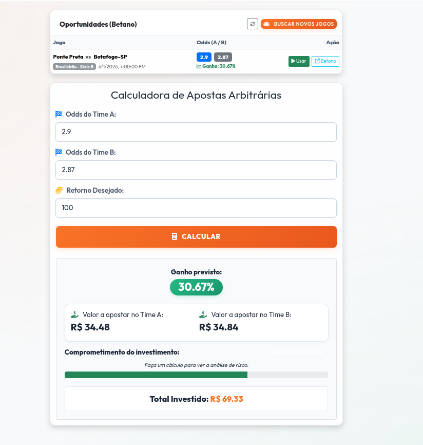

<div align="center">
  
  <h1>Arbitragem de Apostas (Surebet)</h1>
  <p>Uma ferramenta moderna para calcular a distribuição ideal de valores em apostas arbitrárias, garantindo lucros matemáticos independentemente do resultado.</p>

  <p>
    <a href="#sobre">Sobre</a> •
    <a href="#como-funciona">Como Funciona</a> •
    <a href="#tecnologias">Tecnologias</a> •
    <a href="#como-usar">Como Usar</a>
  </p>
</div>

---

## 🎯 Sobre o Projeto

O **Arbitragem de Apostas** é um sistema completo composto por um robô coletor de odds (Web Scraper) e uma interface de cálculo avançada. Ele automatiza o processo de encontrar oportunidades onde as cotações de duas ou mais casas de apostas permitem cobrir todos os resultados possíveis com um lucro garantido (fenômeno conhecido como Surebet ou Arbitragem).

Atualmente o sistema possui integração direta com a API da **Betano**, interceptando o tráfego de rede para coletar as odds mais recentes do Brasileirão (Séries A e B) evitando bloqueios automáticos (anti-bot).

---

## 🚀 Interface do Usuário



> **Dica:** A interface foi redesenhada com um visual premium limpo (Light Mode), focado na experiência de leitura rápida dos cálculos. Ela conta com um painel integrado que permite buscar novas oportunidades (com ganho >30%) em 5 ligas diferentes em tempo real, direto no navegador!

---

## ⚙️ Como Funciona?

O projeto é dividido em três camadas:

1. **Scraper Invisível (Puppeteer):** Escuta o tráfego de rede da Betano e intercepta o JSON interno (sem depender de ler a tela HTML, o que evita o bloqueio da Cloudflare).
2. **Servidor API (Express):** Entrega as oportunidades filtradas (>30% de rentabilidade) para a interface em tempo real.
3. **Calculadora Inteligente:** Você define quanto deseja **ter de retorno total**, e a calculadora diz exatamente quantos reais investir em cada aposta, mostrando sua análise de risco e a viabilidade da transação.

---

## 💻 Tecnologias Utilizadas

- **Frontend:** HTML5, CSS3 Moderno (Glassmorphism), Vanilla JavaScript, Bootstrap 5.
- **Backend:** Node.js, Express.js.
- **Automação/Scraping:** Puppeteer Extra, Stealth Plugin.

---

## 🛠️ Como Usar

### 1. Requisitos
Certifique-se de ter o [Node.js](https://nodejs.org/) instalado na sua máquina (v18 ou superior).

### 2. Instalação
Clone o repositório e instale as dependências:
```bash
git clone https://github.com/seu-usuario/arbitragem-de-apostas.git
cd arbitragem-de-apostas
npm install
```

### 3. Rodando o Servidor Web e Interface
Para visualizar a interface no navegador e ter os endpoints de API disponíveis:
```bash
npm run web
```
Acesse `http://localhost:3000` no seu navegador.

### 4. Coletando Novas Oportunidades
Para atualizar as oportunidades listadas na tela principal, abra outro terminal e execute o nosso robô para coletar as odds em tempo real da Betano:
```bash
npm run scrape
```

---

<div align="center">
  Feito com dedicação e matemática 🧮
</div>